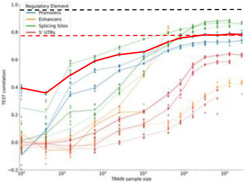
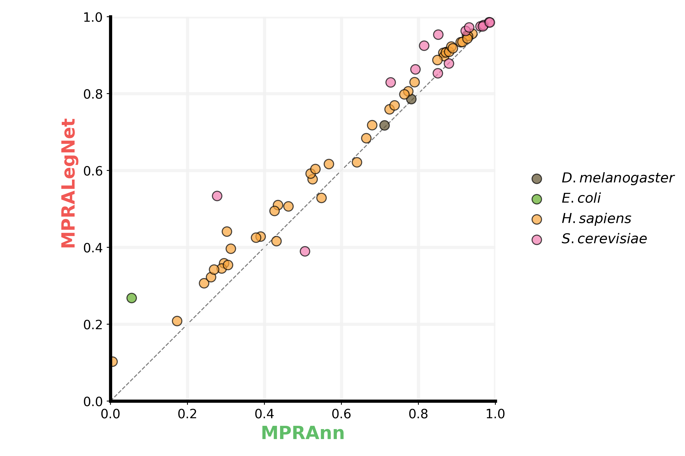
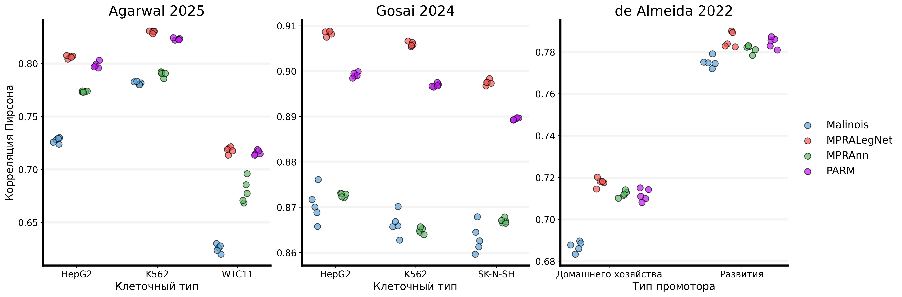
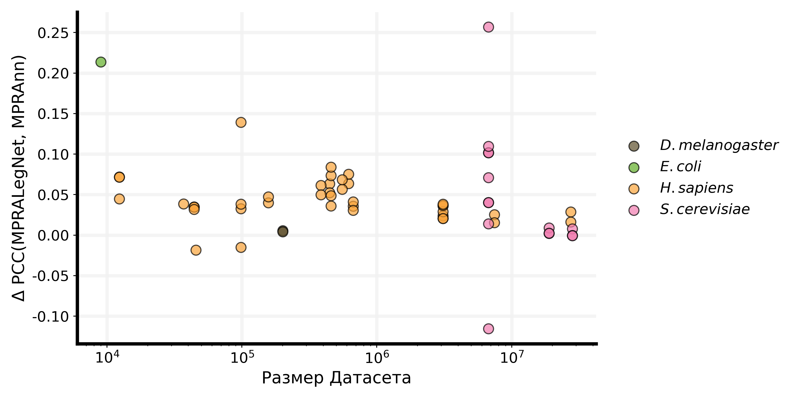
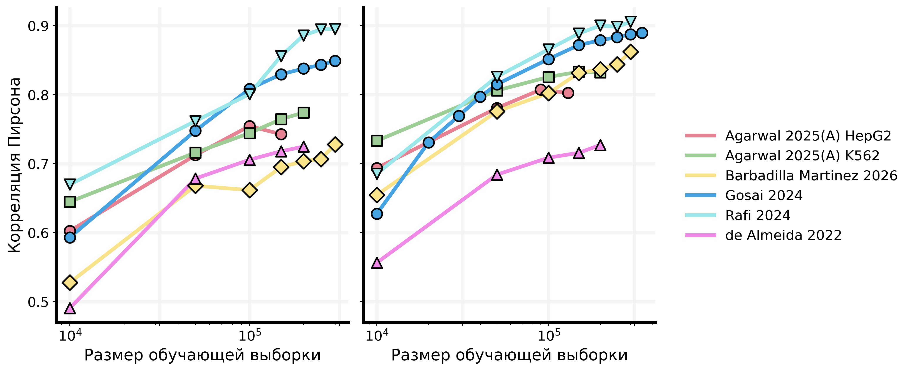
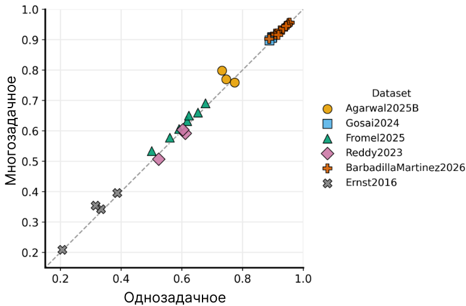
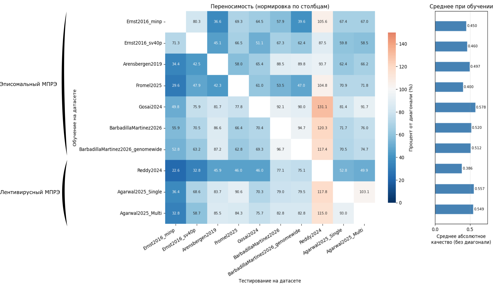



*[Draft paragraph]*

Model comparisons on MPRA (Massively Parallel Reporter Assay) data are supposed to tell us which architectures best capture cis-regulatory grammar — and how much data is actually needed to reach a given level of performance. In practice, conclusions drawn in one paper can silently contradict the very data they're built on: we show a case where a reported performance "plateau" on yeast MPRA data (~0.80 Pearson correlation) falls well short of the 0.96 correlation reported in the original study that produced the data. We introduce **MPRA-MNIST** — a standardized, preprocessed collection of 15 MPRA datasets built in the spirit of MNIST/MedMNIST — designed to remove this kind of ambiguity, complete with reproducible baselines, per-dataset documentation, and tutorial notebooks. 

Using MPRA-MNIST, we validate MPRALegNet as a reproducible baseline that matches or exceeds prior reported results, then benchmark four architectures (MPRAnn, MPRALegNet, Malinois, PARM) across single- vs. multi-target training, dataset scale, and cross-dataset transferability. We find that architecture choice matters consistently and at every data scale, task formulation (single- vs. multi-target) mostly doesn't matter, and cross-dataset transferability is driven more by data quality and volume than by assay type — while performance scaling with dataset size does not saturate as uniformly as previously suggested.

**Code**:
[Benchmark collection repository  ](https://github.com/autosome-ru/MPRA-MNIST/tree/main)



---

## Motivation

*[Draft paragraph]*

Before presenting our approach, it's worth dwelling on an example of the underlying problem: cross-paper conclusions about MPRA data that don't hold up once you trace them back to their source.

Consider a study that set out to answer a natural and useful question: how much training data, drawn from various MPRA experiments, is needed to reach a given level of predictive quality? The authors report learning curves — test correlation as a function of training sample size — for several types of regulatory elements (promoters, enhancers, splicing sites, 5' UTRs).


*[Figure: test Pearson correlation vs. training sample size (log scale), one curve per regulatory element type; highlight the curve corresponding to the yeast dataset]*

The curve we care about here is the one built on yeast MPRA data. In the paper, the authors report that performance on this dataset plateaus once training size reaches roughly 200,000 sequences, at a correlation of around **0.80**.

The problem: the original study that produced this yeast dataset — the one the authors are reusing — reports a correlation of **0.96** on the very same data.

> If the same data supports a correlation of 0.96 in the paper that generated it, what does a "plateau" at 0.80 in a follow-up study actually mean?

The most plausible explanations are mundane rather than scientific: a step or discontinuity in how the learning curve was constructed, or a technical bug in the reuse pipeline — not a genuine data ceiling. And once again we're left with the same underlying issue as before: **the same MPRA data, reused across papers, is producing qualitatively different conclusions that don't reconcile with the original source** — this time not about which model ranks first, but about how much data is actually needed to reach a given level of performance, and where the performance ceiling really sits.

This is precisely the kind of discrepancy that becomes invisible once a number is published and cited forward, and precisely the kind of discrepancy a standardized, traceable benchmark is meant to catch before it propagates.

---

## The key idea: a standardized MPRA benchmark collection

There is a well-established playbook for getting a machine learning community to converge on a problem: **standardized datasets**. Two examples nearly every ML researcher has touched at some point:

- **MNIST** — a collection of handwritten digit images that served as an entry point for generations of ML researchers.
- **MedMNIST** — a derivative collection standardizing medical imaging data.

Following this same paradigm — lowering the barrier to entry and making results directly comparable — we collected MPRA datasets from multiple published studies, preprocessed each one following the protocol described in its original paper, and packaged them into a single standardized collection.

### What we do:

- collect MPRA datasets spanning multiple studies, cell types, and assay designs (episomal and lentiviral)
- reproduce each dataset's original preprocessing pipeline as closely as possible
- standardize the input/output format across datasets so any model can be trained/evaluated with a single interface
- provide baseline model performance for every dataset out of the box
- release detailed documentation and worked usage examples

As of this writing, the collection includes **15 datasets**.

> **Why this matters** — Think of it the same way MNIST let a new researcher train their first digit classifier without worrying about how to parse raw pixel files: this collection lets a new MPRA researcher benchmark a new architecture against known baselines without re-implementing five different papers' preprocessing pipelines from scratch, each with their own undocumented quirks.

## Detailed description of the framework

For each dataset, the MPRA-MNIST Python framework provides a dedicated submodule implementing all dataset-specific functionality. Each submodule contains the code required to load the dataset, perform dataset-specific preprocessing, and configure options that enable flexible use across different experimental setups and prediction tasks.

Each dataset directory also includes documentation describing the dataset, its biological background, and relevant features of the experimental setup, helping users interpret the data and select appropriate preprocessing strategies.

To further reduce the entry barrier, every dataset is accompanied by an executable tutorial Jupyter notebook, which introduces the dataset structure and demonstrates a recommended workflow using default preprocessing parameters and transformation pipelines, and shows how to train a model on the dataset and evaluate its predictive performance.

The workflow demonstrated in each tutorial follows a unified five-step structure:

1. importing the required packages and modules
2. loading the dataset
3. defining preprocessing and transformation steps
4. initializing the model
5. training the model and evaluating its performance
6. Establishing reproducible baseline performance

To establish reference performance metrics for the MPRA-MNIST benchmark, we used MPRALegNet — a convolutional neural network adapted from the EfficientNetV2 architecture and specifically tuned for short nucleotide sequences — as the baseline model across all 15 datasets. To keep results comparable across datasets and avoid dataset-specific tuning, we minimized modifications to the original model architecture: in most cases, only the number of output units and the loss function were adjusted to match the prediction task (e.g. regression vs. classification, single-target vs. multi-target).

Across all datasets, this baseline matches or exceeds the best performance previously reported (or independently re-evaluated by us) in the corresponding original study, giving us a validated, reproducible reference point before making any cross-architecture comparisons.

### Example usage

```python
from mpra_benchmark import load_dataset, load_baseline

# Load a standardized dataset (already split and preprocessed)
train, val, test = load_dataset("agarwal_2025", cell_type="K562")

# Compare against a documented baseline
baseline_scores = load_baseline("agarwal_2025", model="MPRALegNet")
```

We also provide detailed dataset cards describing preprocessing steps, sequence lengths, cell types/organisms, and known caveats for each of the 15 datasets.

## Establishing reproducible baseline performance

To establish reference performance metrics for the MPRA-MNIST benchmark, we used MPRALegNet — a convolutional neural network adapted from the EfficientNetV2 architecture and specifically tuned for short nucleotide sequences — as the baseline model across all 15 datasets. To keep results comparable across datasets and avoid dataset-specific tuning, we minimized modifications to the original model architecture: in most cases, only the number of output units and the loss function were adjusted to match the prediction task (e.g. regression vs. classification, single-target vs. multi-target).

Across all datasets, this baseline matches or exceeds the best performance previously reported (or independently re-evaluated by us) in the corresponding original study, giving us a validated, reproducible reference point before making any cross-architecture comparisons.

### Performance on our datasets

Table 

---

## Model Cmparison

The first application of the MPRA-MNIST toolbox is a systematic comparison of machine learning models for predicting regulatory activity from MPRA data.

### MPRALegNet vs. MPRAnn across all datasets

The original MPRALegNet study tested two models: MPRALegNet itself — an adaptation of the top-performing solution from the DREAM-2022 challenge — and a simpler convolutional network, MPRAnn. While MPRALegNet outperformed MPRAnn on the datasets analyzed in that original study, it remained unclear whether this advantage generalizes beyond the handful of datasets tested there, or whether MPRALegNet should be accepted more broadly as a method of choice.

Here, we systematically compared MPRALegNet and MPRAnn across **all** datasets included in MPRA-MNIST.


*[Figure 3A: scatter plot — x = MPRAnn Pearson r, y = MPRALegNet Pearson r, one point per cell type/experimental condition, averaged over five independent runs, dashed y=x line]*

Each point represents the average Pearson correlation coefficient over five independent runs for a specific cell type or experimental condition within a dataset. Points above the dashed line favor MPRALegNet; points below favor MPRAnn.

**MPRALegNet consistently outperformed MPRAnn across diverse experimental systems and assay designs.** The magnitude of the improvement varies from dataset to dataset, but the overall trend is a robust, reproducible advantage for MPRALegNet over the simpler MPRAnn architecture — not just on the datasets from the original study, but across the full standardized collection.

### Comparison with Malinois and PARM

In a more focused follow-up, we additionally benchmarked two more architectures:

- **Malinois** — an adaptation of the Basset convolutional neural network for MPRA data.
- **PARM** — a convolutional network inspired by the encoder portion of Enformer.

Because Malinois and PARM were originally designed for sequences of roughly 200–600 nt, we restricted this particular comparison to the subset of datasets with sequences of comparable length — including the dataset used in Malinois's own original study.


*[Figure 3B–D: per-dataset panels for Agarwal 2025 (B), Gosai 2024 (C), and de Almeida 2022 (D). X-axis: cell line or promoter type per dataset (K562/HepG2/WTC11 for Agarwal; K562/HepG2/SK-N-SH for Gosai; developmental/housekeeping promoter for de Almeida). Y-axis: Pearson correlation between predicted and measured expression. Each dot = one of five independent runs, colored by model.]*

Across five random seeds, **MPRALegNet consistently outperformed both Malinois and PARM** — and this advantage held even on Malinois's own original benchmark dataset, where Malinois might have been expected to have a home-field advantage.

Together, these results support MPRALegNet as a strong default architecture for short-sequence MPRA modelling, and as a strong baseline against multiple alternative MPRA model designs — while also illustrating the value of MPRA-MNIST for systematic, reproducible cross-dataset model comparison.

---

## Model scaling law

Scaling laws — originally introduced for language models — describe how model performance depends on dataset size and parameter count. In regulatory genomics, this relationship appears to be less straightforward: several recent studies have shown that small models can match or even outperform architectures with two orders of magnitude more parameters.

Using MPRA-MNIST, we investigated two related questions: (1) does the performance advantage of a more sophisticated architecture over a simpler one depend on the size of the training dataset, and (2) how does held-out test performance scale with training data size, and is this relationship consistent across MPRA datasets?

**Does the architecture advantage depend on dataset size?**

A natural objection to any architecture comparison: does the gap between models simply shrink as more training data becomes available? To answer this, we examined the relationship between dataset size and the performance difference between MPRALegNet and MPRAnn.


*[Figure 4A: scatter plot — x = log10(number of sequences), y = ΔPCC (MPRALegNet − MPRAnn), one point per cell type/experimental replicate; positive values favor MPRALegNet]*

**Surprisingly, the performance gain of MPRALegNet over MPRAnn does not depend on dataset size.** This is consistent with the idea that a properly designed architecture and training procedure can be advantageous across many different data regimes: on smaller datasets, a better architecture may help prevent overfitting while still capturing biologically meaningful patterns, while on larger datasets it may let the model learn subtler aspects of regulatory grammar.

> **Takeaway:** this challenges a common assumption in ML-for-molecular-biology — that architectural shortcomings can simply be compensated for with more data, and that differences between carefully optimized and more naïve models disappear at sufficiently large scale. In our data, they don't.

**How does performance scale with training set size?**

To dig deeper into scaling behavior itself, we analyzed how predictive performance depends on training set size for each regression-task dataset in MPRA-MNIST, progressively varying training set size and evaluating on the corresponding held-out test set (averaging over multiple test sets where more than one was associated with the same training dataset).


*[Figure 4B: two panels — MPRALegNet (left) and MPRAnn (right); x-axis = log10(number of training samples), y-axis = Pearson correlation; one line per dataset]*

As expected, predictive performance for both models generally increases with training set size, and in most cases follows an approximately linear relationship with the logarithm of training set size — consistent with scaling behavior observed elsewhere in machine learning.

However, the slope of this relationship varies across datasets and differs between the two architectures. For some datasets, performance plateaus as training size grows — possibly reflecting either limited diversity among additional training examples, or a ceiling on predictive performance set by experimental noise or intrinsic biological variability. For other datasets, no **plateau is observed even at the largest available dataset sizes** (including the largest available yeast dataset in the collection).

This last finding is notable because it contrasts with a previous conclusion in the literature suggesting that MPRA datasets generally saturate in performance once training size reaches roughly 100,000 sequences — a pattern we do not observe consistently across our standardized collection.

---

## Comparing single-target and multi-target modelling

Whether multi-target learning provides an advantage over single-target modelling is a long-standing debate in regulatory genomics. Multi-target models may exploit shared information across related tasks (e.g. related cell types or conditions), but they may also learn spurious correlations between targets; well-tuned single-target models may match their performance while avoiding that failure mode.

We used MPRA-MNIST to compare single-target and multi-target formulations of MPRALegNet on the subset of datasets that support both settings.


*[Figure 5: scatter plot — x = single-target Pearson r, y = multi-target Pearson r, one point per cell type/condition per dataset, dashed y=x line]*

**No consistent advantage of multi-target learning is observed when performance is aggregated across datasets.** Multi-target training does improve performance in some individual cases, but these gains are not systematic, and are insignificant overall.

> **Takeaway:** the choice between single-target and multi-target training is not a critical performance lever in this setting — it can reasonably be made based on practical convenience (e.g. training or deployment simplicity) rather than an expected accuracy gain.
---

## Cross-dataset transferability

The final question we asked: **how well does a model trained on one MPRA dataset transfer to another?**

### Building the transferability heatmap

We trained MPRALegNet separately on every K562 dataset in the collection, then evaluated each trained model on every other K562 dataset, producing a full pairwise performance matrix.

To make the matrix interpretable, we normalized each column by its diagonal value — that is, by the performance of the model trained *and* tested on the same dataset. This puts every diagonal cell at exactly 100%. A cell above 100% means the model trained on a *different* dataset predicts better on the test set than the model trained on the test set's own training split.


*[Heatmap: rows = training dataset, columns = test dataset, values normalized to diagonal = 100%]*

### What the heatmap reveals

Three main findings:

**1. Ernst 2016 is a noisy dataset.** Its columns are uniformly low (dark) in the heatmap: models trained *and* tested on Ernst 2016 top out around 0.4 Pearson correlation, and models trained on any other dataset don't do better when tested on Ernst 2016 either. The ceiling itself appears to be low — consistent with a high noise floor in this particular assay's measurements, rather than a modeling failure.

**2. Reddy 2024 has too little data to learn from on its own.** Models trained on larger datasets transfer to the Reddy 2024 test set *better* than a model trained on Reddy 2024 itself — normalized values reach as high as 131%. With only around 20,000 sequences, there isn't enough data for a model to learn robust regulatory grammar from scratch; grammar learned on a larger, unrelated dataset transfers in more effectively.

**3. Assay type alone does not determine transferability.** We do not see a clean separation in the heatmap between episomal and lentiviral assays. What matters more is dataset volume and sequence origin — whether sequences are genomic or synthetic, and whether the dataset is large enough for the model to learn stable regulatory patterns in the first place.

---

## Implications

*[Draft paragraph]*

Taken together, these results support two practical conclusions for anyone working with MPRA models:

- **Architecture choice is not a solved problem** — deeper, more expressive models (MPRALegNet, PARM) consistently outperform simpler baselines (MPRAnn, Malinois) regardless of data scale, so architecture selection deserves real attention rather than defaulting to whichever baseline is easiest to implement.
- **Not all MPRA datasets are equally trustworthy on their own** — some (like Ernst 2016) are limited by assay noise, and some (like Reddy 2024) are limited by sample size; the transferability heatmap gives a data-driven way to identify which datasets benefit most from being combined with others rather than modeled in isolation.

More broadly, this points back to the motivating problem: conclusions drawn from reused MPRA data — whether about model rankings or about where a performance plateau actually sits — are not automatically trustworthy just because the underlying data is nominally "the same." A standardized benchmark collection with validated, reproducible baselines is one concrete way to catch this kind of discrepancy before it propagates into the literature.

---

## Open questions

*[Draft]*

- Can transferability be predicted ahead of time from dataset metadata (size, assay type, cell type), rather than only measured post-hoc via a full pairwise heatmap?
- How do these findings hold up for architectures beyond the four tested here (e.g. transformer-based or foundation-model encoders)?

---

## Takeaway — the TL;DR

Conclusions drawn from reused MPRA data are not automatically trustworthy — we show a case where a reported performance plateau on yeast data (~0.80 Pearson correlation) falls well short of the 0.96 correlation reported in the original source study.

> Standardizing datasets and preprocessing, MNIST-style, is a practical first step toward making MPRA model comparisons trustworthy again.

Using such a standardized collection of 15 datasets, we find that architecture choice matters consistently and at every data scale, task formulation (single- vs multi-task) mostly doesn't matter, and cross-dataset transferability is driven more by data quality and volume than by assay type.

---

## Code

The standardized dataset collection, preprocessing pipelines, baseline model implementations, all code used to produce the analyses and figures in this post is available at: [repository link](#).

### Tutorial

*[Draft a short code walkthrough here, e.g. loading a dataset, training a baseline, and comparing to the published baseline scores]*

---

## Conclusion

- Conclusions drawn from reused MPRA data are not automatically trustworthy — even when the underlying data is nominally "the same," reported metrics (e.g. a learning-curve plateau) can silently contradict the original source study.
- We built a standardized, MNIST-style collection of 15 preprocessed MPRA datasets to remove this ambiguity going forward.
- Using this collection, we show that architecture choice (MPRALegNet, PARM > MPRAnn, Malinois) matters consistently across scale, that single- vs multi-task training makes little difference, and that cross-dataset transferability depends more on data volume/quality than assay type.

> A standardized benchmark won't settle every modeling question in this space on its own, but it removes one major source of noise from the conversation: whether two papers' numbers are even comparable in the first place.

### Code

Dataset collection and baselines: [link](#)

Analysis and experiments: [link](#)

---

## References

*[Fill in full citations]*

1. [Study reporting the yeast MPRA learning-curve plateau — source of the motivating example].
2. [Original yeast MPRA study reporting 0.96 Pearson correlation on the same data].
3. LeCun, Y. et al. MNIST handwritten digit database.
4. [MedMNIST citation].
5. [MPRAnn citation].
6. [MPRALegNet citation].
7. [Malinois citation].
8. [PARM citation].
9. Gosai et al. 2024 [dataset citation].
10. de Almeida et al. 2022 [dataset citation].
11. Ernst et al. 2016 [dataset citation].
12. Reddy et al. 2024 [dataset citation].

### Cite this post:

Your Name. "A Standardized Benchmark for MPRA Models: Why Cross-Study Comparisons Break Down." *Your Blog*, DD Month 2026. <link>.